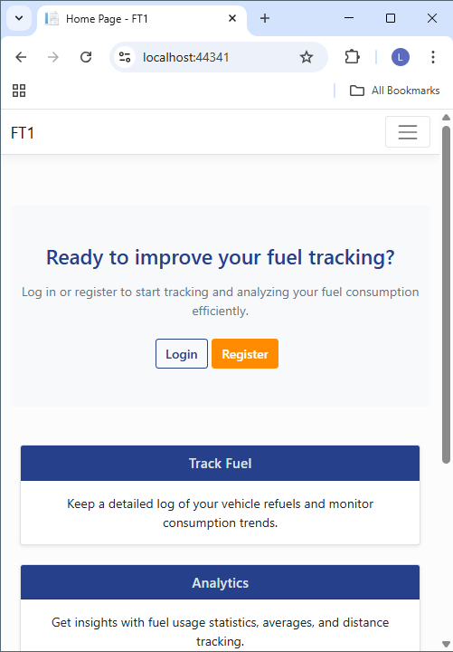
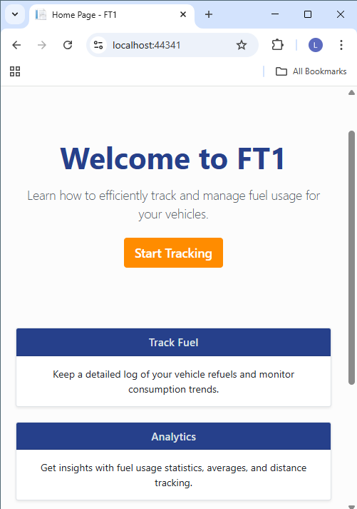
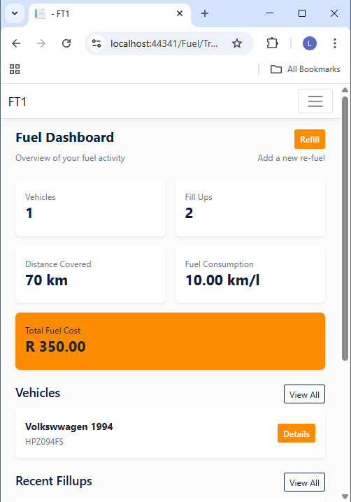
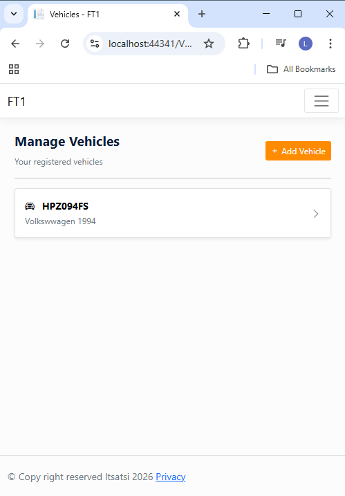
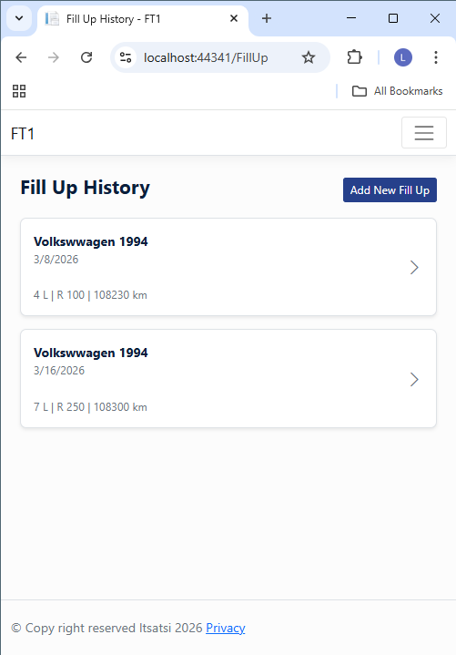
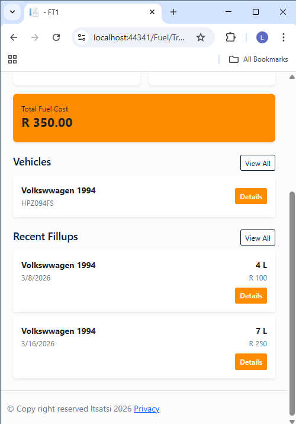

# Fuel Tracking Application

A vehicle fuel tracking web application built with **ASP.NET Core MVC** that allows users to manage their vehicles, record fuel fill-ups, and monitor fuel consumption over time.
This project was built to demonstrate **backend development skills using C# and .NET**, including data modeling, business logic implementation, and structured MVC architecture.

---

## Overview

The Fuel Tracking Application enables users to:

- Register and manage vehicles
- Record fuel fill-ups
- Track odometer readings
- Calculate fuel consumption
- View fuel usage statistics

Each user interacts only with **their own vehicles and fuel records**, ensuring proper data ownership and isolation.

---

## Key Features

- Vehicle management
- Fuel fill-up tracking
- Fuel consumption calculations
- Odometer validation rules
- Dashboard statistics
- Clean ASP.NET Core MVC architecture

---

## Backend Concepts Demonstrated

### C# / .NET

- ASP.NET Core MVC
- Dependency Injection
- Asynchronous programming (`async/await`)
- LINQ queries
- Domain-driven data modeling

### Data & Persistence

- Entity Framework Core
- SQLite database
- Code-first database design
- Entity relationships

### Application Architecture

- MVC pattern
- Repository pattern
- ViewModels for data transfer
- Separation of concerns
- Encapsulated business logic

### Validation & Business Rules

- Server-side validation
- Custom validation attributes
- Odometer progression checks
- Fuel consumption calculation logic

---

## Tech Stack

**Backend**
- C#
- .NET / ASP.NET Core MVC
- Entity Framework Core

**Database**
- SQLite

**Frontend**
- Razor Views
- Bootstrap 5
- HTML / CSS

**Tools**
- Visual Studio
- Git & GitHub

---

## Example Business Logic

Fuel consumption is calculated using:

Fuel Consumption = Distance Travelled / Fuel Used

Where:
- Distance travelled is determined using odometer readings
- Fuel used is obtained from recorded fill-up data

This ensures realistic tracking based on actual vehicle usage.

---

## Application Screenshots

### Landing page (Signed out)


### Landing page (Signed in)


### Dashboard


Displays key statistics and fuel usage insights.

### Vehicles


Users can manage multiple vehicles.

### Fill-Up History


Users record fuel purchases and odometer readings.

### Statistics


Shows calculated fuel consumption and trends.

---

## Project Structure

```
FuelTrackingApp
|
--- Controllers
    |--- FillUpController
    |--- DashboardController
|
--- Models
    |--- Vehicle
    |--- FillUp
|
--- ViewModels
|
--- Repositories
|
--- Data
    |--- ApplicationDbContext
|
--- Views
```

---

## Running the Project

### Clone the repository

git clone https://github.com/ltsatsi/FT_MVC.git

### Navigate to the project

cd fuel-tracking-app

### Run the application

dotnet run

Then open:

https://localhost:5001

---

## Future Improvements

- REST API endpoints
- Fuel usage charts
- Authentication and user accounts
- Mobile responsive dashboard
- Exportable fuel reports

---

## What This Project Demonstrates

This project highlights my ability to:

- Build backend systems with **C# and .NET**
- Implement real-world **domain logic**
- Design structured **ASP.NET MVC applications**
- Work with **databases using Entity Framework Core**
- Apply **clean architecture principles**

---

## Author

Lebogang Tsatsi  
Backend Developer — C# / .NET

GitHub: https://github.com/ltsatsi

---

## License

This project is licensed under the MIT License.
